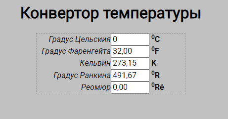

# Temperature-converter

## Конвертор температуры

Веб приложение конвертирует температуру из форматов температуры Градус Цельсиия, Градус Фаренгейта, Кельвин, Градус Ранкина, Реомюр, в любой из них.

## Снимок экрана

 [Ссылка на демо](https://stanislav0305.github.io/Temperature-converter/)

 ## Описание Node.js-проекта
- В качестве рабочего инструмента использовался Visual Studio Code
- В качестве основного языка программирования использовался **TypeSctipt**
- А также использовался **HTML** и **SCSS**

## Описание окружения для сборки проекта
Были использованы следующие инструменты:
- **node.js** - программная платформа
- **npm** - менеджер пакетов для **node.js**
- **webpack** - инструмент для сборки проекта

### Общая концепция
- `src/` - каталог для размещения рабочих файлов (html, scss, ts, изображения и шрифтов),
- `docs/` - каталог для размещения готовой верстки,
- `build/` - каталог для размещения готовой верстки для разработки и отладки, без минимизации.

Вся работа осуществляется в каталоге `src/`.

### NPM скрипты
 - `$ npm run start` - собирает проект в папку `build/` без минификации в режиме разработки и запускает вебсервер с проектом;
 - `$ npm run build-dev` - собирает проект в папку `build/` без минификации в режиме разработки;
 - `$ npm run build-prod` - собирает проект в папку `docs/` с минификацией в режиме производства;
 - `$ npm run clear-dev` - очистка папки `build/` от всего содержимого;

#### Были использованы следующие npm пакеты:
 - Основные:
    - [webpack](https://www.npmjs.com/package/webpack) - сам webpack,
    - [webpack-cli](https://www.npmjs.com/package/webpack-cli) - консоль webpack - чтоб вебпаком управлять и команды разные писать;
    - [webpack-dev-server](https://www.npmjs.com/package/webpack-dev-server) - для запуска локального веб-сервера с живой перезагрузкой;

- Для работы с файлами изображений:
    - [image-webpack-loader](https://www.npmjs.com/package/image-webpack-loader) - уменьшает объём изображения в форматах PNG, JPEG, GIF, SVG и WEBP;

- Для работы с HTML:
    - [html-loader](https://www.npmjs.com/package/gulp-file-include) - экспортирует HTML как строку. HTML минифицируется по требованию компилятора;
    - [html-webpack-plugin](https://www.npmjs.com/package/html-webpack-plugin) - это плагин, который упрощает создание HTML-файлов. Это особенно полезно для файлов, которые содержат в имени файла хеш, который меняется при каждой компиляции. Вы можете либо позволить плагину сгенерировать для вас HTML-файл, либо предоставить свой собственный шаблон, используя шаблоны lodash, либо использовать собственный загрузчик;

- Для работы с SCSS и CSS:
    - [css-loader](https://www.npmjs.com/package/css-loader) - CSS-загрузчик интерпретирует @import и url() как import/require() и разрешает их;
    - [mini-css-extract-plugin](https://www.npmjs.com/package/mini-css-extract-plugin) - этот плагин извлекает CSS в отдельные файлы. Он создает файл CSS для каждого файла JS, который содержит CSS. Он поддерживает загрузку CSS и SourceMaps по требованию. Он основан на новой функции webpack v5 и для работы требует наличия webpack 5;
    - [postcss](https://www.npmjs.com/package/postcss) - инструмент для преобразования стилей с помощью плагинов JS. Эти плагины могут анализировать ваш CSS, поддерживать переменные и миксины, транспилировать будущий синтаксис CSS, встроенные изображения и многое другое;
    - [postcss-loader](https://www.npmjs.com/package/postcss-loader) - загрузчик для обработки CSS с помощью PostCSS;
    - [postcss-preset-env](https://www.npmjs.com/package/postcss-preset-env) - позволяет конвертировать современный CSS во что-то, понятное большинству браузеров, определяя нужные вам полифилы на основе ваших целевых браузеров или сред выполнения;
    - [sass](https://www.npmjs.com/package/sass) - этот пакет представляет собой дистрибутив Dart Sass, скомпилированный на чистом JavaScript без собственного кода или внешних зависимостей. Он предоставляет исполняемый файл sass для командной строки и API Node.js;
    - [sass-loader](https://www.npmjs.com/package/sass-loader) - загружает файл SASS/SCSS и компилирует его в CSS;
    - [style-loader](https://www.npmjs.com/package/style-loader) - внедряет CSS в DOM;

- Для работы с TS и JS:
    - [typescript](https://www.npmjs.com/package/typescript) - транспилятор TypeScript;
    - [ts-loader](https://www.npmjs.com/package/ts-loader) - загрузчик TypeScript;
    - [babel-loader](https://www.npmjs.com/package/babel-loader) - этот пакет позволяет транспилировать файлы JavaScript с помощью Babel и webpack;
    - [@babel/core](https://www.npmjs.com/package/@babel/core) - ядро компилятора Babel. Babel - это транспилятор, который, в основном, используется для преобразования конструкций, принятых в свежих версиях стандарта ECMAScript, в вид, понятный как современным, так и не самым новым браузерам;
    - [@babel/preset-env](https://www.npmjs.com/package/@babel/preset-env) - переписывает транспилированый JavaScript, чтобы финальный синтаксис работал в любом браузере, который указаны в конфигурации проекта;
    - [core-js](https://www.npmjs.com/package/core-js) - модульная стандартная библиотека для JavaScript. Включает полифилы для ECMAScript до 2023 года. Используется для поддержки старых браузеров. В текущем проекте не использовалась, но добавлена в webpack конфигурацию и при необходимости можно импортировать нужный функционал в код;

  [Ссылка на демо](https://stanislav0305.github.io/Temperature-converter/)